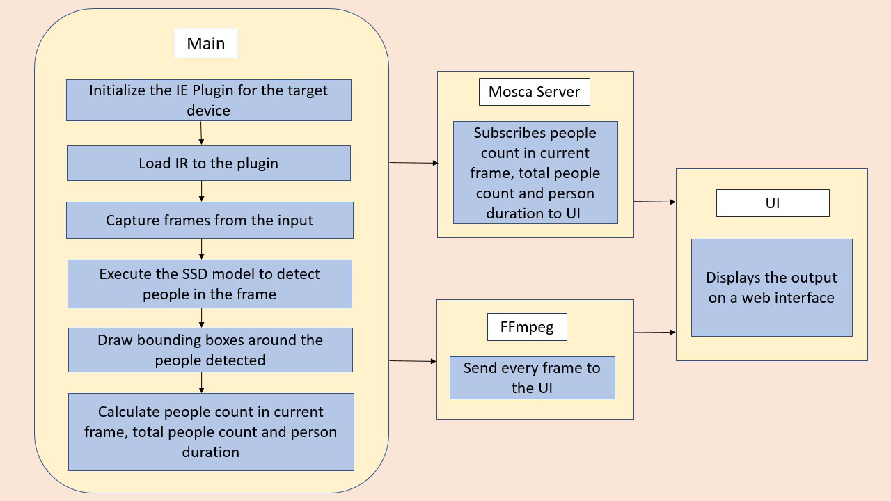

# Deploy a People Counter App at the Edge

The people counter application demonstrates how to create a smart video IoT solution using Intel® hardware and software tools. The app will detect people in a designated area, providing the number of people in the frame, average duration of people in frame, and total count. This project is a part of Intel Edge AI for IOT Developers Nanodegree program by udacity.

### How it works?

The counter will use the Inference Engine included in the Intel® Distribution of OpenVINO™ Toolkit. The model used should be able to identify people in a video frame. The application should count the number of people in the current frame, the duration that a person is in the frame (time elapsed between entering and exiting a frame) and the total count of people. It then sends the data to a local web server using the Paho MQTT Python package.

## Requirements

### Hardware

* 6th to 10th generation Intel® Core™ processor with Iris® Pro graphics or Intel® HD Graphics.
* OR use of Intel® Neural Compute Stick 2 (NCS2)

### Software

*   Intel® Distribution of OpenVINO™ toolkit 2019 R3 release
*   Node v6.17.1
*   Npm v3.10.10
*   CMake
*   MQTT Mosca server
*   Python 3.5 or 3.6
  
  
### Explaining Model Selection & Custom Layers

### Comparing Model Performance

### Model Use Cases

### Effects on End user needs

### Running the Main Application
